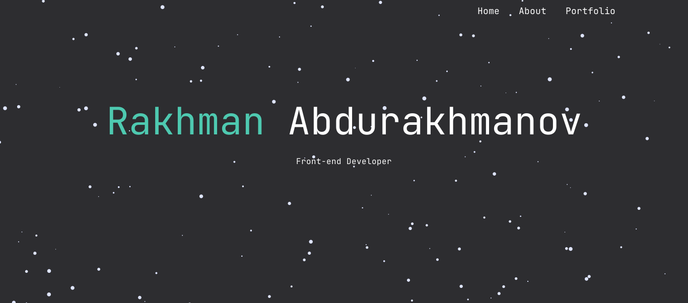

# My Portfolio Website

This is the source code for my personal portfolio site. The site includes 3
pages: Home, About, Portfolio. The `Home` page displays my social links.
Visitors can download a copy of my resume from the `About` page. The `Portfolio`
page hosts some of the projects I have built in my free time. You can get in
touch with me by sending mail.

## Screenshots

## Built With

-   Bootstrap
-   React
-   TypeScript

## Authors

Rakhman Abdurakhmanov - [Portfolio](https://crystallographer.github.io) |
[GitHub](https://github.com/crystallographer).

Based on [Portfolio](https://github.com/ksentak/keaton-portfolio) by
[Keaton Sentak](https://keatonsentak.com).
